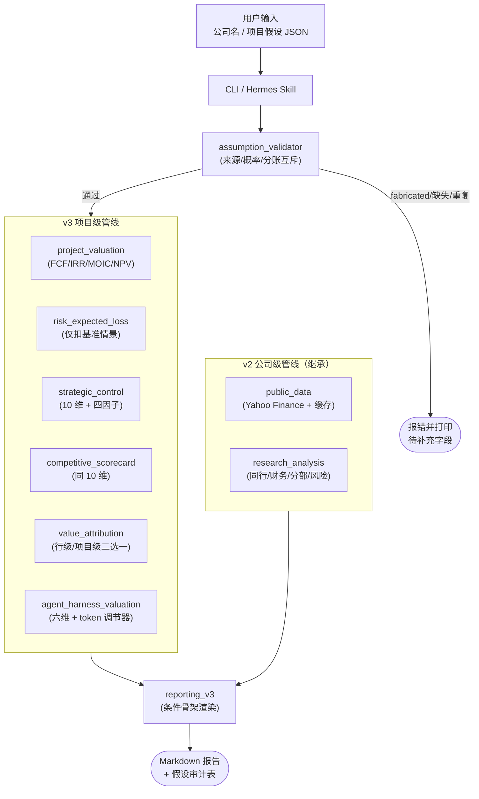
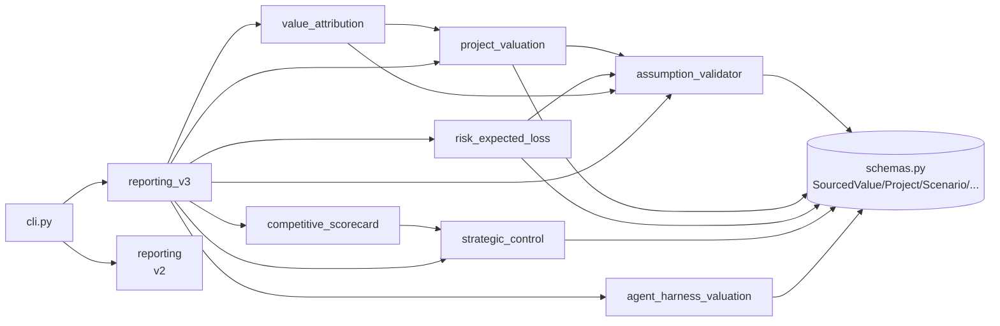
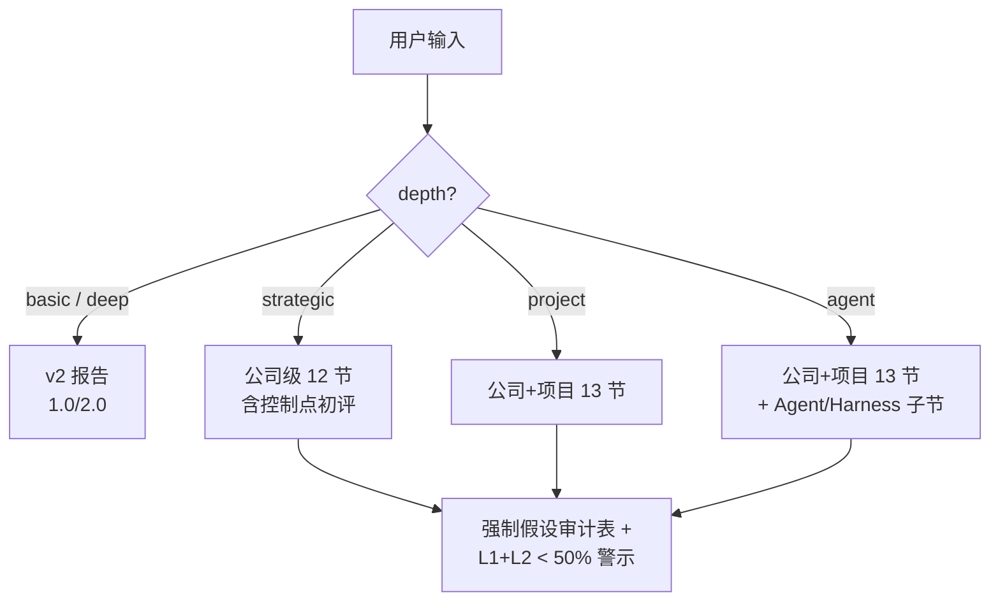

# 投研估值 Agent 3.0

`valuation-agent` 是一个面向上市公司的投研估值 Agent，基于 Hermes Agent + Skills 构建。它把"识别 → 公开数据获取 → 估值计算 → 报告生成"拼成可复核的端到端管线。

3.0 版本在 v2 公司级深度投研基础上新增**项目级现金流穿透 + 战略价值建模**，回答的不再只是"市场给了多少倍"，而是"业务到底能产生多少自由现金流，且其中多少归属上市公司"。

---

## 版本演进

| 版本 | 形态 | 解决的问题 |
|---|---|---|
| v1.0 | 估值计算工具 | 公司名 → ticker → PE/PS 倒推 → 三情景 → Markdown 报告 |
| v2.0 | 通用上市公司投研 Agent | + 多期财务质量、业务分部、可比公司、风险反证、深度报告 |
| **v3.0** | 战略价值与项目现金流穿透 Agent | + 项目级 FCF/IRR/MOIC/NPV、五情景、控制点、风险期望损失、价值归属、Agent/Harness 估值、假设来源审计 |

3.0 设计与开发计划：[docs/V3_DESIGN_AND_DEV_PLAN.md](docs/V3_DESIGN_AND_DEV_PLAN.md)。

---

## 3.0 核心能力

- **项目级经营模型**：五年收入/成本/EBIT/税/FCF/累计 FCF；IRR、MOIC、NPV、回收期。
- **五情景分析**：极悲观 / 悲观 / 基准 / 乐观 / 极乐观，每个情景独立调整收入倍率、毛利、归属比例、折现率、CAPEX、激活风险，输出概率加权 NPV。
- **战略控制点评分**：10 维统一 schema（网关、数据安全、Agent 生命周期、行业 Know-how、渠道、技术、系统集成、留存、资源、复制方法论），四因子映射到公司估值溢价（控制点 × 战略权重 × 收入占比 × 叙事放大），避免小项目控制点被错误放大到整体估值。
- **风险期望损失**：按情景的概率/损失矩阵，**仅扣减基准情景**，与五情景叙事不重复扣减（前置 `validate_risk_no_scenario_overlap` 校验）。
- **价值归属**：行级 owner_share 与项目级 partner_shares 二选一（互斥校验），输出归属上市公司 NPV、按 PE/PS 倍数换算的市值增量。
- **Agent/Harness 估值**：六维加权（Model / Harness / Skill / Security / Workflow / Outcome）+ Token 调节器（0.5–1.5）+ 估值溢价带（discount / neutral / premium / platform_premium）。
- **假设来源审计**：每条数字带 source 等级（L1 user_explicit ~ L5 derived），禁止 L6 fabricated，L1+L2 占比低于 50% 报告头部打"高假设依赖"警示。
- **竞争情报评分**：复用 10 维 schema，输出排名、优势/短板、相对位次的估值倍数建议。
- **报告骨架按输入分支**：`--depth strategic` 公司级 12 节；`--depth project` 公司+项目 13 节；`--depth agent` 在项目骨架基础上插入 Agent/Harness 子节。

---

## 系统架构

### 端到端管线



### 模块依赖



### 假设来源等级（L1–L5；禁止 L6）

```mermaid
flowchart TD
    L1[L1 user_explicit<br/>用户显式输入<br/>conf 0.90] --> Pipe[validator]
    L2[L2 disclosed<br/>年报/公告/新闻稿<br/>conf 0.85] --> Pipe
    L3[L3 template<br/>项目类型默认值<br/>conf 0.50] --> Pipe
    L4[L4 analogy<br/>同行业类比<br/>conf 0.40] --> Pipe
    L5[L5 derived<br/>由其他假设推导<br/>conf 取最小] --> Pipe
    L6X["L6 fabricated<br/>LLM 编造"] -.禁止.-> X((reject))
    Pipe --> Audit[报告"假设审计表"]
```

### 报告骨架按输入分支



---

## 目录结构

```text
valuation-agent/
├── config/                      # 别名、同行池、风险规则、控制点权重、Agent 权重、模板
│   ├── company_aliases.json
│   ├── peer_groups.json
│   ├── business_profiles.json
│   ├── risk_rules.json
│   ├── strategic_control_weights.json   # v3
│   ├── competitive_scorecards.json      # v3
│   ├── agent_harness_weights.json       # v3
│   ├── project_templates.json           # v3
│   ├── risk_matrix_templates.json       # v3
│   └── partner_split_templates.json     # v3
├── data/
├── docs/                        # 各版本设计、Roadmap、ARCHITECTURE
├── skills/                      # Hermes Skills（v1/v2 + v3 新增 7 个）
├── tests/                       # 单元 + 集成测试（共 64+ 用例）
└── valuation_agent/             # 主代码包
    ├── schemas.py
    ├── assumption_validator.py          # v3
    ├── project_valuation.py             # v3
    ├── strategic_control.py             # v3
    ├── competitive_scorecard.py         # v3
    ├── risk_expected_loss.py            # v3
    ├── value_attribution.py             # v3
    ├── agent_harness_valuation.py       # v3
    ├── reporting_v3.py                  # v3
    ├── cli.py
    ├── pipeline.py
    ├── reporting.py
    ├── research_analysis.py
    ├── public_data.py
    ├── calculators.py
    ├── cache.py
    ├── storage.py
    └── paths.py
```

---

## 快速验证

```bash
cd valuation-agent
python3 -m unittest discover -s tests
```

### v2 路径

```bash
python3 -m valuation_agent.cli generate-report --query <company>
python3 -m valuation_agent.cli generate-report --query <company> --depth deep
python3 -m valuation_agent.cli generate-report --query <company> --depth deep --refresh
```

### v3 路径

公司级战略报告（含控制点初评）：

```bash
python3 -m valuation_agent.cli generate-report \
  --query <company> \
  --depth strategic \
  --control-scores '{"gateway_control":80,"data_security":75,"agent_lifecycle":85,"industry_knowhow":70,"channel_access":60,"technology":75,"system_integration":70,"retention":65,"resource_mobilization":60,"repeatable_methodology":70}' \
  --project-strategic-weight 0.6 --project-revenue-share 0.10 --narrative-amplification 2.0
```

公司+项目报告：

```bash
python3 -m valuation_agent.cli generate-report \
  --query <company> \
  --depth project \
  --project-assumptions ./assumptions/<project>.json \
  --risks ./assumptions/<project>_risks.json \
  --partners ./assumptions/<project>_partners.json \
  --multiple 12
```

公司 + AI Agent 项目（额外渲染 Agent/Harness 子节）：

```bash
python3 -m valuation_agent.cli generate-report \
  --query <company> \
  --depth agent \
  --project-assumptions ./assumptions/<project>.json \
  --agent-scores '{"model_intelligence":80,"harness_quality":85,"skill_surface":70,"identity_security_control":75,"workflow_ownership":80,"outcome_pricing_ability":60}' \
  --token-cost-score 70 \
  --multiple 12
```

`--depth` 取值与报告骨架对应：

| --depth | 报告骨架 | 必需输入 |
|---|---|---|
| basic | v2 摘要 | --query 或显式财务参数 |
| deep | v2 深度 | --query 或显式财务参数 |
| strategic | 3.0 公司级（含控制点初评） | --query |
| project | 3.0 公司+项目 | --query, --project-assumptions |
| agent | 3.0 公司+项目 + Agent/Harness 章节 | --query, --project-assumptions, --agent-scores |

---

## ProjectAssumptions JSON 形态

```json
{
  "base_case": {
    "project_name": "<project>",
    "start_year": 2026,
    "years": [2026, 2027, 2028, 2029, 2030],
    "tax_rate": {"value": 0.25, "source": "user_explicit"},
    "discount_rate": {"value": 0.15, "source": "user_explicit"},
    "revenue_lines": [
      {
        "name": "subscription_fee",
        "category": "subscription",
        "base_values": {
          "2026": {"value": 50.0, "source": "user_explicit"},
          "2027": {"value": 80.0, "source": "user_explicit"}
        },
        "owner_share": {"value": 0.45, "source": "user_explicit"},
        "gross_margin": {"value": 0.55, "source": "user_explicit"}
      }
    ],
    "cost_lines": [],
    "capex_lines": [
      {"name": "platform_buildout", "category": "capex",
       "base_values": {"2026": {"value": 30.0, "source": "user_explicit"}}}
    ]
  },
  "scenarios": {
    "very_bear": {"scenario_probability": 0.10, "revenue_multiplier": {"subscription_fee": 0.5}},
    "bear":      {"scenario_probability": 0.20, "revenue_multiplier": {"subscription_fee": 0.75}},
    "base":      {"scenario_probability": 0.40, "revenue_multiplier": {"subscription_fee": 1.0}},
    "bull":      {"scenario_probability": 0.20, "revenue_multiplier": {"subscription_fee": 1.20}},
    "very_bull": {"scenario_probability": 0.10, "revenue_multiplier": {"subscription_fee": 1.50}}
  },
  "attribution_method": "row_level_via_owner_share"
}
```

source 字段必须是 `user_explicit` / `disclosed` / `template` / `analogy` / `derived` 之一。`fabricated` 会被 `assumption_validator` 直接拒绝。

---

## Skills

v1/v2：`market-data-skill`, `financial-report-skill`, `financial-normalization-skill`, `valuation-skill`, `scenario-analysis-skill`, `peer-comparison-skill`, `research-report-skill`。

v3 新增：

| Skill | 职责 |
|---|---|
| `project-valuation-skill` | 项目现金流、五情景、IRR/MOIC/Payback/NPV |
| `risk-expected-loss-skill` | 风险矩阵 + 期望损失（仅扣基准情景） |
| `strategic-control-skill` | 10 维控制点评分 + 四因子估值溢价 |
| `competitive-scorecard-skill` | 同 10 维相对竞争位次 |
| `value-attribution-skill` | 多方分账与归属上市公司价值（行级/项目级互斥） |
| `agent-harness-valuation-skill` | AI Agent / Harness 六维 + Token 调节器 |
| `strategic-report-skill` | 3.0 综合报告（按 depth 选择骨架） |

---

## Hermes Skills 导入

### 通过飞书界面安装

```text
/skills install zhanglunet/valuation-agent --now
```

如果当前 Hermes 部署不支持从 GitHub repo 自动识别多 Skill 目录：

```text
请安装 valuation-agent：git clone https://github.com/zhanglunet/valuation-agent.git /tmp/valuation-agent，然后把 /tmp/valuation-agent/skills/* 复制到 ~/.hermes/skills/，最后 /reset 让技能生效。
```

安装后验证：

```text
@Hermes 请用 valuation-agent 分析<某上市公司>
```

### 通过本地目录导入

方式一：复制到 Hermes 默认目录。

```bash
mkdir -p ~/.hermes/skills
cp -r skills/* ~/.hermes/skills/
```

方式二：在 Hermes 配置中加入当前项目 Skill 路径。

```yaml
skills:
  paths:
    - "~/.hermes/skills"
    - "/Users/john/dev/估值模型/valuation-agent/skills"
```

---

## 版本边界（3.0 不做）

- 月度或季度颗粒度现金流（仅年度）。
- 蒙特卡洛敏感性（仅五情景 + 关键变量单变量 ±20% 表）。
- 资本结构优化、税盾建模、可转债稀释（项目层面假设给定 WACC 和税率）。
- IRR hurdle rate 建议或资本预算判断（只展示 IRR，由用户判断是否过线）。
- LLM 编造（fabricated）的项目假设。任何缺失字段必须由用户/披露/模板/类比/推导提供。
- 自动准确解析所有 Excel 财务模型；自动获取所有非公开项目数据；直接给出投资建议。

公开数据（行情、市值、财务）通过 Yahoo Finance 接口与本地缓存获取，可能存在延迟和口径差异，正式投研应以交易所公告和公司年报为准。

本系统仅用于研究分析辅助，不构成投资建议。

---

## 文档

- [安装与导入](docs/INSTALL.md)
- [Skills 说明](docs/SKILLS.md)
- [程序架构](docs/ARCHITECTURE.md)
- [Roadmap](docs/ROADMAP.md)
- [1.0 设计方案](docs/V1_DESIGN.md)
- [2.0 设计方案](docs/V2_DESIGN_AND_DEV_PLAN.md)
- [2.0 正式版设计](docs/V2_FINAL_DESIGN_AND_DEV_PLAN.md)
- [**3.0 设计方案与开发计划**](docs/V3_DESIGN_AND_DEV_PLAN.md)
- [3.0 发布说明](docs/RELEASE_NOTES_v3.0.0.md)
