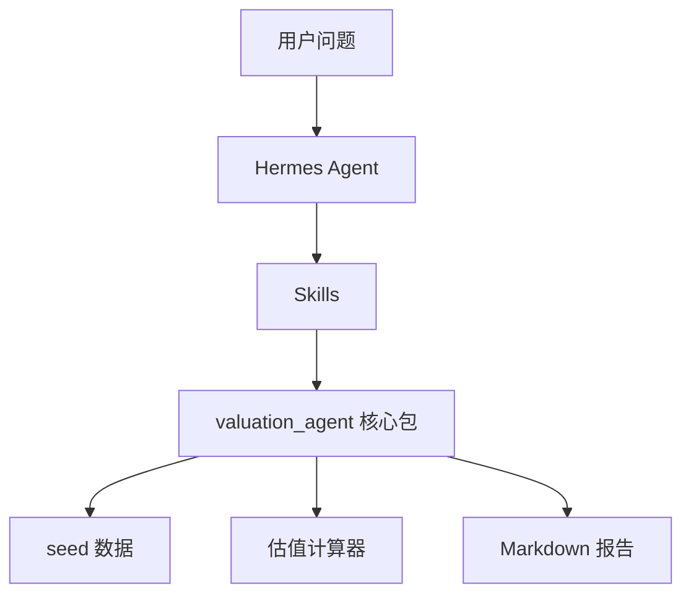

# 程序架构

## 核心包

- `schemas.py`：公共数据模型。
- `storage.py`：配置和 seed 数据读取。
- `calculators.py`：估值、标准化、情景分析。
- `pipeline.py`：端到端分析编排。
- `reporting.py`：报告生成。
- `cli.py`：命令行入口。

## 1.0 边界

1.0 不抓实时数据，全部使用 `data/seed/asiasoft_1675_hk.json`。这样可以先验证 Agent + Skills 的业务闭环。
