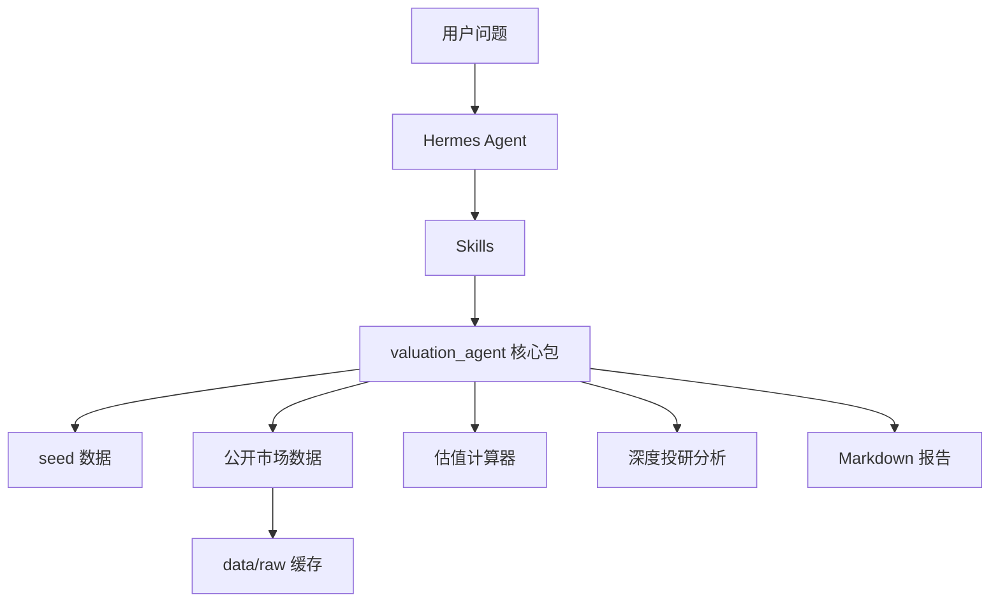

# 程序架构

## 核心包

- `schemas.py`：公共数据模型。
- `storage.py`：配置和 seed 数据读取。
- `calculators.py`：估值、标准化、情景分析。
- `public_data.py`：公司检索、行情和公开财务数据获取。
- `cache.py`：公开数据 JSON 缓存。
- `pipeline.py`：端到端分析编排。
- `research_analysis.py`：可比公司、财务质量、业务分部、驱动因素、风险反证和问题清单。
- `reporting.py`：报告生成。
- `cli.py`：命令行入口。

## 2.0 边界

2.0 通过 Yahoo Finance 公开接口自动检索任意上市公司的 ticker、行情、市值、股本、财务摘要和多期财务历史。用户也可以显式输入 ticker、股本、收入、利润、目标市值等参数覆盖公开数据；`data/seed/sample_listed_company.json` 仅作为本地回归测试示例。

中文简称先通过 `config/company_aliases.json` 解析到公开市场 ticker，再进入公开数据抓取流程；未命中别名表时，回退到 Yahoo Finance 搜索。

深度报告由 `research_analysis.py` 负责组织，当前主要依赖：

- `config/peer_groups.json`：同行池和可比原因。
- `config/business_profiles.json`：业务分部初始 profile。
- `config/risk_rules.json`：可配置风险触发规则。
