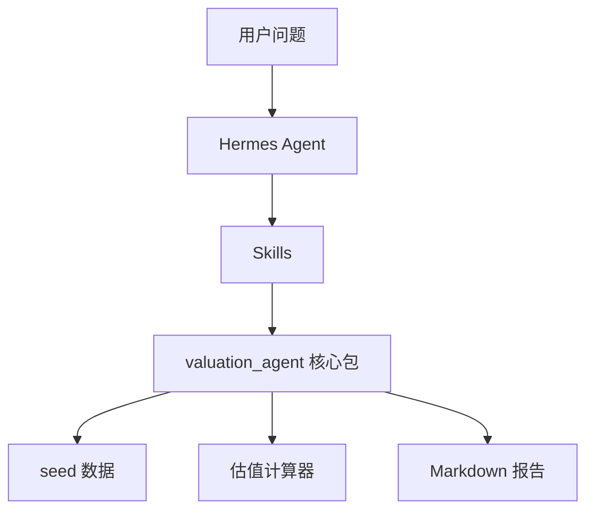

# 程序架构

## 核心包

- `schemas.py`：公共数据模型。
- `storage.py`：配置和 seed 数据读取。
- `calculators.py`：估值、标准化、情景分析。
- `pipeline.py`：端到端分析编排。
- `reporting.py`：报告生成。
- `cli.py`：命令行入口。

## 1.0 边界

1.0 通过 Yahoo Finance 公开接口自动检索任意上市公司的 ticker、行情、市值、股本和财务摘要。用户也可以显式输入 ticker、股本、收入、利润、目标市值等参数覆盖公开数据；`data/seed/sample_listed_company.json` 仅作为本地回归测试示例。

中文简称先通过 `config/company_aliases.json` 解析到公开市场 ticker，再进入公开数据抓取流程；未命中别名表时，回退到 Yahoo Finance 搜索。
