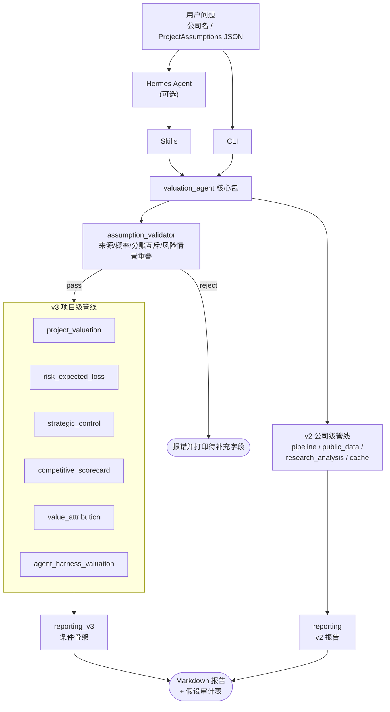

# 程序架构

## 总体管线（v3）

## 模块职责

### v3 新增模块

- `schemas.py`（扩充）：v3 数据结构 `SourcedValue` / `ProjectAssumptions` / `ScenarioOverride` / `CashFlowResult` / `StrategicControlScore` / `CompetitiveScoreResult` / `RiskExpectedLoss` / `ValueAttribution` / `AgentHarnessScore` / `AssumptionAudit`。
- `assumption_validator.py`：项目假设强校验（来源等级、归属方法互斥、五情景概率和、风险/情景重叠）+ 报告假设审计表生成。
- `project_valuation.py`：FCF / IRR / MOIC / Payback / NPV 计算；五情景遍历与概率加权 NPV。
- `risk_expected_loss.py`：按情景概率/损失矩阵；仅扣减基准情景 NPV。
- `strategic_control.py`：10 维控制点评分 + 四因子映射到公司估值溢价。
- `competitive_scorecard.py`：复用 10 维 schema 计算相对位次与多倍数溢价建议。
- `value_attribution.py`：行级 owner_share 与项目级 partner_shares 互斥；NPV 与 market_cap_uplift 两步分离。
- `agent_harness_valuation.py`：AI Agent / Harness 六维加权 + Token 调节器 + 估值溢价带映射。
- `reporting_v3.py`：按 `--depth` 路由三种骨架（strategic / project / agent）。

### v1 / v2 模块（继承）

- `storage.py`：配置和 seed 数据读取。
- `calculators.py`：估值、标准化、情景分析。
- `public_data.py`：公司检索、行情和公开财务数据获取。
- `cache.py`：公开数据 JSON 缓存。
- `pipeline.py`：端到端分析编排。
- `research_analysis.py`：可比公司、财务质量、业务分部、驱动因素、风险反证和问题清单。
- `reporting.py`：v1/v2 报告生成。
- `cli.py`：命令行入口（v3 扩充 `--depth strategic|project|agent` 与对应参数）。

## 关键设计原则

1. **假设来源显式化**：每条数字带 `source` 等级（L1 user_explicit ~ L5 derived），禁止 L6 fabricated。`assumption_validator` 在所有计算前强制校验。
2. **不重复扣减**：风险矩阵与五情景叙事互斥（前置校验）；行级 owner_share 与项目级 partner_shares 互斥（前置校验）。
3. **小项目不放大估值**：控制点 → 公司估值溢价采用四因子（控制点 × 战略权重 × 收入占比 × 叙事放大）映射，project_revenue_share 强力衰减。
4. **报告骨架按输入分支**：纯公司请求渲染 12 节，公司+项目渲染 13 节，公司+AI Agent 项目额外插入 Agent/Harness 子节。
5. **缺失不编造**：缺失字段集中聚合到"待补充字段"清单。`fabricated` 来源直接抛错，不进入计算。

## 配置文件

| 文件 | 用途 |
|---|---|
| `config/company_aliases.json` | 中文别名 → ticker（v1） |
| `config/peer_groups.json` | 同行池与可比原因（v2） |
| `config/business_profiles.json` | 业务分部 profile（v2） |
| `config/risk_rules.json` | 公司级风险触发规则（v2） |
| `config/strategic_control_weights.json` | 10 维控制点权重（v3） |
| `config/competitive_scorecards.json` | 行业级竞争评分权重（v3） |
| `config/agent_harness_weights.json` | Agent / Harness 六维权重（v3） |
| `config/project_templates.json` | 项目类型模板（v3） |
| `config/risk_matrix_templates.json` | 风险矩阵模板（v3） |
| `config/partner_split_templates.json` | 合作分账模板（v3） |
