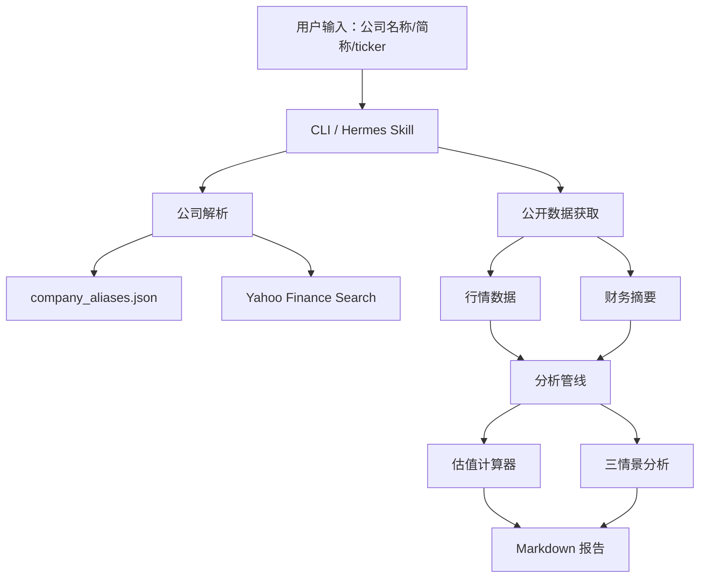

# Valuation Agent 1.0 设计方案

## 1. 版本定位

Valuation Agent 1.0 是一个面向上市公司的公开信息估值分析 Agent。它的目标不是替代投研判断，而是先把“公司识别、公开数据获取、基础估值计算和报告生成”跑通，形成后续 2.0 深度投研分析的稳定底座。

1.0 的核心使用方式：

```text
请分析<某上市公司>
```

或：

```bash
python3 -m valuation_agent.cli generate-report --query <company>
```

系统会自动完成：

1. 识别公司名称、简称或股票代码。
2. 解析上市代码。
3. 获取公开行情和财务摘要。
4. 计算市值、股价、股本、PE、PS。
5. 生成基础三情景估值分析。
6. 输出 Markdown 报告。

## 2. 设计目标

### 2.1 用户输入最小化

用户只需要提供上市公司名称、简称或股票代码。系统会通过本地别名表和公开数据源自动补齐 ticker、交易所、币种、行情、股本和财务摘要。

### 2.2 计算逻辑可复核

估值相关公式全部写入代码，不依赖模型临场生成。

核心计算包括：

- 目标市值倒推股价。
- 隐含 PE。
- 隐含 PS。
- 不同 PE 假设下所需净利润。
- 悲观、中性、乐观三情景估值。

### 2.3 数据来源可追踪

公开数据字段保留来源 URL。报告中会显示行情和财务数据来源。

### 2.4 输出可直接阅读

1.0 输出 Markdown 报告，适合作为飞书、GitHub、CLI 或后续 DOCX/PPTX 的基础格式。

## 3. 系统架构



## 4. 核心模块

### 4.1 公司解析

文件：

- `valuation_agent/public_data.py`
- `config/company_aliases.json`

流程：

1. 先查 `company_aliases.json`。
2. 如果命中，直接得到 ticker。
3. 如果未命中，使用 Yahoo Finance Search 查询。
4. 返回标准化公司对象。

示例：

```json
{
  "<中文别名 A>": "<TICKER_A>",
  "<中文别名 B>": "<TICKER_B>",
  "<中文别名 C>": "<TICKER_C>"
}
```

### 4.2 公开数据获取

文件：

- `valuation_agent/public_data.py`

当前公开数据源：

- Yahoo Finance Search：公司名到 ticker 解析。
- Yahoo Finance Chart：股价、交易所、币种。
- Yahoo Finance Fundamentals Timeseries：收入、净利润、平均股数等财务摘要。

注意：

- Yahoo Finance 数据用于原型和公开信息分析。
- 正式投研结论应以交易所公告和公司披露为准。

### 4.3 估值计算器

文件：

- `valuation_agent/calculators.py`

核心函数：

- `market_cap_to_price`
- `implied_pe`
- `implied_ps`
- `required_net_profit`
- `normalize_financials`
- `calculate_valuation`
- `scenario_analysis`

### 4.4 分析管线

文件：

- `valuation_agent/pipeline.py`

核心入口：

- `run_company_analysis(company_id, target_market_cap)`
- `run_payload_analysis(payload)`

`run_payload_analysis` 支持两种模式：

1. 用户只给公司名，系统自动获取公开数据。
2. 用户手工传入指标，手工输入覆盖公开数据。

### 4.5 报告生成

文件：

- `valuation_agent/reporting.py`

报告章节：

1. 核心结论。
2. 当前市场表现。
3. 目标市值倒推。
4. 财务基本面。
5. 隐含估值倍数。
6. 达成目标市值所需利润。
7. 三情景分析。
8. 关键驱动因素。
9. 主要风险。
10. 计算警告。
11. 免责声明。

## 5. Skills 设计

1.0 提供 7 个 Hermes Skills：

| Skill | 职责 |
|---|---|
| `market-data-skill` | 获取行情快照 |
| `financial-report-skill` | 获取财务摘要 |
| `financial-normalization-skill` | 统一币种和单位 |
| `valuation-skill` | 估值计算 |
| `scenario-analysis-skill` | 三情景分析 |
| `peer-comparison-skill` | 可比公司占位接口 |
| `research-report-skill` | 生成 Markdown 报告 |

1.0 中 `peer-comparison-skill` 仍是占位实现，2.0 会升级为真实可比公司分析。

## 6. 数据与配置

### 6.1 配置文件

```text
config/
├── assumptions.json
├── companies.json
├── company_aliases.json
└── hermes-config.yaml
```

### 6.2 Seed 数据

```text
data/seed/sample_listed_company.json
```

Seed 数据仅用于离线测试和回归验证，不作为默认目标公司。

### 6.3 报告输出

```text
data/reports/
```

报告文件默认不进入版本管理，避免把临时分析结果当作源码提交。

## 7. 命令行使用

### 7.1 公司名自动分析

```bash
python3 -m valuation_agent.cli generate-report --query <company>
```

### 7.2 股票代码自动分析

```bash
python3 -m valuation_agent.cli generate-report --query <TICKER>
```

### 7.3 手工参数覆盖

```bash
python3 -m valuation_agent.cli generate-report \
  --ticker <TICKER> \
  --company-name "<Listed Company Inc.>" \
  --currency USD \
  --target-market-cap 3000000000000 \
  --shares-outstanding 15000000000 \
  --share-price 190 \
  --revenue 380000000000 \
  --adjusted-net-profit 95000000000
```

## 8. 飞书 / Hermes 使用

安装 Skill：

```text
/skills install zhanglunet/valuation-agent --now
```

使用：

```text
@Hermes 请用 valuation-agent 分析<某上市公司>
```

如果当前 Hermes 部署不支持从 GitHub repo 自动识别多 Skill 目录，可以手工复制：

```bash
mkdir -p ~/.hermes/skills
cp -r valuation-agent/skills/* ~/.hermes/skills/
```

## 9. 测试设计

测试目录：

```text
tests/
├── test_calculators.py
├── test_pipeline.py
└── test_public_data.py
```

当前覆盖：

- 基础估值公式。
- 三情景分析。
- seed 数据分析。
- 任意公司手工参数分析。
- 公司名公开数据补全。
- 中文别名解析。
- Markdown 报告生成。

运行：

```bash
python3 -m unittest discover -s tests
```

## 10. 1.0 边界

1.0 已实现：

- 公司名、简称、ticker 输入。
- 中文别名解析。
- Yahoo Finance 公开行情和财务摘要获取。
- PE / PS / 市值倒推股价。
- 三情景分析。
- Markdown 报告生成。
- Hermes Skills 包装。
- 基础测试覆盖。

1.0 暂未实现：

- 真实可比公司分析。
- 业务分部深度拆解。
- 财务质量多期分析。
- 风险反证。
- DCF。
- EV/EBITDA。
- DOCX / PPTX 输出。
- 年报 PDF 深度解析。

这些能力进入 2.0 设计和开发计划。

## 11. 质量与合规声明

- 本系统仅使用公开信息和用户输入数据。
- 自动抓取的公开数据可能存在延迟或口径差异。
- 报告仅用于研究分析辅助，不构成投资建议。
- 投资判断应以交易所公告、公司披露和人工复核为准。

