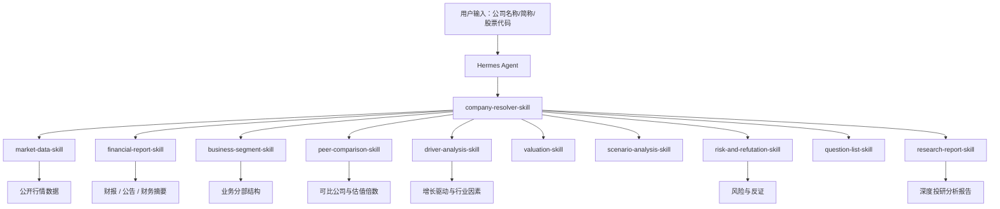

# Valuation Agent 2.0 设计方案与开发计划

## 1. 版本定位

`valuation-agent` 1.0 已经解决“能不能算”的问题：输入上市公司名称、简称或股票代码后，系统可以自动获取公开行情和财务摘要，完成市值、股价、PE、PS 和三情景测算。

2.0 要解决“分析是否到位”的问题。目标是从估值计算工具升级为投研分析 Agent：

> 只给上市公司名称，Agent 自动获取公开信息，拆解公司业务、财务质量、可比公司、估值差异、增长驱动、风险反证和待验证问题，生成一份更接近投研备忘录的分析报告。

## 2. 2.0 核心目标

### 2.1 从计算到判断

1.0 输出：

- 当前市值是多少。
- 隐含 PE / PS 是多少。
- 目标市值对应股价是多少。
- 三情景估值区间是多少。

2.0 输出：

- 为什么当前估值合理或不合理。
- 公司业务增长由哪些分部支撑。
- 与同行相比贵在哪里、便宜在哪里。
- 估值差异来自增长、利润率、业务结构、风险还是市场偏好。
- 哪些假设一旦不成立，估值就站不住。
- 还需要进一步验证哪些关键数据。

### 2.2 保持输入简单

用户侧仍保持一句话入口：

```text
请分析腾讯控股
```

或：

```text
请分析 Apple
```

系统内部自动完成：

1. 公司识别。
2. 股票代码解析。
3. 公开行情获取。
4. 财务摘要获取。
5. 行业与可比公司识别。
6. 业务分部和驱动因素提取。
7. 估值和敏感性分析。
8. 风险与反证分析。
9. 报告生成。

## 3. 2.0 总体架构



## 4. 新增核心模块

### 4.1 公司识别模块

模块名称：`company-resolver-skill`

职责：

- 支持中文名称、英文名称、简称、股票代码。
- 从 `config/company_aliases.json` 先做本地别名解析。
- 未命中时使用公开搜索接口解析。
- 返回标准公司对象。

输出字段：

```json
{
  "company_name": "Tencent Holdings Limited",
  "ticker": "0700.HK",
  "exchange": "HKSE",
  "currency": "HKD",
  "industry": "Interactive Media & Services",
  "source": "alias_or_public_search"
}
```

开发重点：

- 扩充中文别名表。
- 增加歧义处理，例如“Apple”可能是公司，也可能是普通词。
- 返回候选列表，而不是只返回第一个结果。

### 4.2 业务分部拆解模块

模块名称：`business-segment-skill`

职责：

- 从公开年报、公告或财务摘要中提取业务分部。
- 识别收入来源、利润来源和增长来源。
- 判断核心业务、新业务和拖累业务。

第一版可采用“规则 + 文本摘要”的混合方案：

- 如果公开 API 有 segment 数据，优先结构化读取。
- 如果没有结构化数据，抓取年报 / 公司官网业务介绍 / Yahoo profile 做文本抽取。
- 如果仍然缺失，输出“业务分部待验证”，不编造。

输出结构：

```json
{
  "segments": [
    {
      "name": "核心业务",
      "revenue": null,
      "growth": null,
      "margin": null,
      "description": "",
      "role": "core"
    }
  ],
  "segment_quality": "partial",
  "missing_fields": ["segment_revenue", "segment_margin"]
}
```

报告中需要回答：

- 公司到底靠什么业务赚钱。
- 增长主要来自哪个业务。
- 哪个业务可能带来估值重估。
- 哪个业务可能拖累估值。

### 4.3 财务质量分析模块

模块名称：`financial-quality-skill`

职责：

- 分析收入增长、利润率、现金流、资产负债质量。
- 判断盈利质量是否支撑估值。
- 标记异常项。

核心指标：

- 收入增速。
- 毛利率。
- 经营利润率。
- 净利率。
- ROE / ROA。
- 经营现金流 / 净利润。
- 净现金或净债务。
- 股本变化。

输出结构：

```json
{
  "growth": {
    "revenue_growth": null,
    "net_profit_growth": null
  },
  "margin": {
    "gross_margin": null,
    "net_margin": null
  },
  "cashflow": {
    "operating_cash_flow": null,
    "ocf_to_net_income": null
  },
  "quality_flags": [
    "revenue_available_but_cashflow_missing"
  ]
}
```

### 4.4 可比公司分析模块

模块名称：`peer-comparison-skill`

2.0 要把当前占位实现升级成真正可用模块。

职责：

- 自动识别同行公司。
- 获取可比公司行情和财务摘要。
- 计算 PE、PS、市值、收入、利润率。
- 输出行业中位数和目标公司分位数。
- 解释估值差异。

同行来源优先级：

1. `config/peer_groups.json` 手工维护的高质量同行池。
2. Yahoo Finance 行业分类。
3. 搜索结果同业候选。
4. 后续接入交易所行业分类或第三方公开数据。

输出结构：

```json
{
  "target": {
    "ticker": "0700.HK",
    "pe": 18.8,
    "ps": 5.6
  },
  "peers": [
    {
      "ticker": "BIDU",
      "company_name": "Baidu",
      "market_cap": 0,
      "revenue": 0,
      "net_profit": 0,
      "pe": 0,
      "ps": 0
    }
  ],
  "median": {
    "pe": 0,
    "ps": 0,
    "net_margin": 0
  },
  "positioning": {
    "pe_percentile": null,
    "ps_percentile": null,
    "summary": ""
  }
}
```

报告中需要回答：

- 相比同行，公司估值是高还是低。
- 高估值是否由更高增长或更高利润率支撑。
- 低估值是否反映业务风险或市场忽视。
- 哪些同行最适合比较，哪些只是弱可比。

### 4.5 增长驱动因素模块

模块名称：`driver-analysis-skill`

职责：

- 从业务分部、财务指标、行业信息中提炼增长驱动因素。
- 区分短期、中期、长期驱动。
- 对每个驱动因素给出可验证指标。

驱动因素分类：

- 行业空间。
- 产品周期。
- 客户增长。
- ARPU / 客单价提升。
- 市占率提升。
- 毛利率改善。
- 成本费用优化。
- 新业务放量。
- 海外扩张。
- 政策或周期复苏。
- AI / 云 / 数据 / 机器人等主题驱动。

输出结构：

```json
{
  "drivers": [
    {
      "name": "新业务放量",
      "horizon": "medium_term",
      "evidence": [],
      "monitoring_metrics": ["segment_revenue_growth"],
      "confidence": "medium"
    }
  ]
}
```

### 4.6 风险与反证模块

模块名称：`risk-and-refutation-skill`

职责：

- 不只列风险，还要说明哪些情况会推翻当前估值结论。
- 输出“反证清单”。

风险分类：

- 业绩不达预期。
- 收入增长放缓。
- 利润率下降。
- 现金流恶化。
- 行业估值中枢下移。
- 核心客户流失。
- 新业务不及预期。
- 政策监管。
- 汇率与利率。
- 股本摊薄。

输出结构：

```json
{
  "risks": [
    {
      "risk": "收入增长放缓",
      "impact": "估值倍数和盈利预测同时承压",
      "early_warning_metrics": ["revenue_growth", "order_backlog"],
      "severity": "high"
    }
  ],
  "refutation_tests": [
    {
      "hypothesis": "目标公司估值合理",
      "would_be_wrong_if": "未来 12 个月收入增速低于行业中位数且利润率下滑"
    }
  ]
}
```

### 4.7 待验证问题模块

模块名称：`question-list-skill`

职责：

- 将分析中缺失、不确定或需要人工判断的事项变成问题清单。
- 帮投研人员知道下一步该查什么。

问题分类：

- 财务口径问题。
- 业务分部问题。
- 可比公司问题。
- 估值假设问题。
- 风险验证问题。

输出示例：

```json
{
  "questions": [
    {
      "category": "business_segment",
      "question": "最新年度各业务分部收入和利润率分别是多少？",
      "priority": "high"
    }
  ]
}
```

## 5. 报告模板升级

2.0 报告结构：

```markdown
# 公司投研估值分析报告

## 1. 核心结论
## 2. 公司与业务概览
## 3. 业务分部拆解
## 4. 财务质量分析
## 5. 增长驱动因素
## 6. 可比公司分析
## 7. 估值分析与交叉验证
## 8. 情景与敏感性分析
## 9. 风险与反证
## 10. 待验证问题清单
## 11. 数据来源与免责声明
```

每一节都要区分：

- 已有数据。
- 基于数据的判断。
- 缺失数据。
- 需要人工验证的假设。

## 6. 数据设计升级

### 6.1 新增配置

```text
config/
├── company_aliases.json
├── peer_groups.json
├── industry_taxonomy.json
└── analysis_templates.json
```

### 6.2 新增缓存

```text
data/
├── raw/
│   ├── search/
│   ├── market/
│   ├── financials/
│   ├── profiles/
│   └── filings/
├── normalized/
│   ├── company_profiles.json
│   ├── financial_metrics.json
│   ├── segment_metrics.json
│   └── peer_metrics.json
└── reports/
```

### 6.3 新增 Schema

需要新增：

- `BusinessSegment`
- `FinancialQuality`
- `PeerCompany`
- `PeerComparisonResult`
- `GrowthDriver`
- `RiskItem`
- `RefutationTest`
- `ResearchQuestion`
- `DeepResearchReport`

## 7. Skill 清单

### 7.1 现有 Skill 升级

| Skill | 当前状态 | 2.0 改造 |
|---|---|---|
| `market-data-skill` | 获取单公司行情 | 增加缓存、来源追踪、异常处理 |
| `financial-report-skill` | 获取财务摘要 | 增加历史多期指标和财务质量字段 |
| `valuation-skill` | PE / PS / 股价倒推 | 增加 EV/EBITDA、DCF 简版、交叉验证 |
| `scenario-analysis-skill` | 固定三情景 | 增加敏感性矩阵和行业参数 |
| `peer-comparison-skill` | 占位 | 升级为真实可比公司分析 |
| `research-report-skill` | 生成基础报告 | 升级为深度投研报告 |

### 7.2 新增 Skill

| Skill | 职责 | 优先级 |
|---|---|---|
| `company-resolver-skill` | 公司名、简称、ticker 解析 | P0 |
| `business-segment-skill` | 业务分部拆解 | P0 |
| `financial-quality-skill` | 财务质量分析 | P0 |
| `driver-analysis-skill` | 增长驱动因素分析 | P1 |
| `risk-and-refutation-skill` | 风险与反证分析 | P1 |
| `question-list-skill` | 待验证问题生成 | P1 |
| `filing-fetch-skill` | 年报、公告、公司资料抓取 | P2 |

## 8. 开发计划

### Phase 0：重构准备，0.5-1 天

目标：为 2.0 留出清晰边界。

任务：

1. 新建 `valuation_agent/research/` 包。
2. 新建 `valuation_agent/data_sources/` 包。
3. 把 Yahoo Finance 数据源从 `public_data.py` 拆到 `data_sources/yahoo.py`。
4. 增加 `schemas_research.py` 或拆分到 `schemas/` 目录。
5. 增加 `config/peer_groups.json`。

验收：

- 1.0 所有测试继续通过。
- `generate-report --query 腾讯` 继续可用。

### Phase 1：可比公司分析，2-3 天

目标：把 `peer-comparison-skill` 从占位变成可用。

任务：

1. 建立首批同行池：
   - 港股互联网。
   - 美股大型科技。
   - A 股白酒。
   - 新能源车。
   - 企业软件。
2. 实现同行公司批量公开数据获取。
3. 计算同行 PE、PS、市值、收入、净利率。
4. 计算中位数、均值、目标公司分位数。
5. 生成可比公司分析结论。

验收：

```bash
python3 skills/peer-comparison-skill/peer_comparison_skill.py '{"company_name":"腾讯"}'
```

应输出：

- 目标公司。
- 可比公司列表。
- 估值倍数表。
- 行业中位数。
- 目标公司相对位置。

### Phase 2：业务分部与财务质量，3-5 天

目标：让报告能解释公司靠什么业务赚钱、财务质量是否支撑估值。

任务：

1. 新增 `business-segment-skill`。
2. 新增 `financial-quality-skill`。
3. 优先从公开 profile、年报摘要和财务 time-series 获取信息。
4. 无法结构化时输出缺失字段，不编造。
5. 在报告中增加“业务分部拆解”和“财务质量分析”章节。

验收：

- 报告能列出业务分部或明确说明分部数据缺失。
- 报告能输出至少 5 个财务质量指标。
- 对缺失数据有提示。

### Phase 3：风险、反证和待验证问题，2-3 天

目标：让报告更像投研人员的工作底稿。

任务：

1. 新增 `risk-and-refutation-skill`。
2. 新增 `question-list-skill`。
3. 根据估值倍数、增长、利润率、缺失数据生成风险。
4. 根据风险生成反证清单。
5. 根据缺失字段生成待验证问题。

验收：

- 报告必须包含“什么情况下当前结论会错”。
- 报告必须包含高优先级待验证问题。

### Phase 4：报告整合与体验优化，2 天

目标：生成完整 2.0 深度报告。

任务：

1. 升级 `research-report-skill`。
2. 增加 `--depth basic|deep` 参数。
3. `basic` 保持 1.0 报告。
4. `deep` 输出 2.0 报告。
5. 优化 Markdown 表格和数据来源展示。

验收：

```bash
python3 -m valuation_agent.cli generate-report --query 腾讯 --depth deep
```

输出报告包含：

- 业务分部。
- 财务质量。
- 可比公司。
- 增长驱动。
- 风险反证。
- 待验证问题。

### Phase 5：Hermes / 飞书验收，1 天

目标：飞书里可自然使用。

验收问题：

```text
请深度分析腾讯控股
```

期望：

- 自动识别公司。
- 自动调用多个 Skill。
- 输出结构化深度报告。
- 不编造缺失数据。
- 明确数据来源和不确定性。

## 9. 2.0 验收标准

### 9.1 功能验收

必须支持：

- 公司名 / 简称 / ticker 输入。
- 自动公开数据获取。
- 可比公司分析。
- 业务分部拆解。
- 财务质量分析。
- 增长驱动因素。
- 风险与反证。
- 待验证问题。
- 深度报告输出。

### 9.2 质量验收

报告必须满足：

- 不能只给框架，要有具体分析。
- 每个判断尽量绑定数据依据。
- 缺失数据必须明确标记。
- 可比公司必须解释可比性。
- 风险不能泛泛而谈，要能反证估值结论。
- 结论必须分层：短期、中期、长期。

### 9.3 测试验收

新增测试：

- 公司解析测试。
- 可比公司池测试。
- 同行倍数计算测试。
- 业务分部缺失处理测试。
- 财务质量指标测试。
- 风险反证生成测试。
- 深度报告结构测试。

## 10. 开发顺序建议

建议按这个顺序实现，避免一上来做太大：

1. 先做 `peer-comparison-skill`。
2. 再做 `financial-quality-skill`。
3. 再做 `business-segment-skill`。
4. 然后做 `risk-and-refutation-skill`。
5. 最后升级 `research-report-skill --depth deep`。

原因：

- 可比公司分析最能提升报告含金量。
- 财务质量分析数据最容易从现有接口延展。
- 业务分部数据不一定稳定，需要更强缺失处理。
- 风险与反证依赖前面模块的结论。

## 11. 2.0 最小可交付版本

如果只做一个最小 2.0，应包含：

1. 真实可比公司分析。
2. 财务质量分析。
3. 风险与反证。
4. 深度报告模板。

暂时可以延后：

- 年报 PDF 深度解析。
- DCF 完整模型。
- DOCX / PPTX 输出。
- 自动行业知识图谱。

## 12. 开发注意事项

- 不要为了报告完整而编造业务分部数据。
- 所有公开接口都要有 fallback 和错误提示。
- Yahoo Finance 数据可用于原型，但报告需声明“以交易所公告和公司披露为准”。
- 可比公司池宁可少而准，不要自动塞一堆弱相关公司。
- 所有分析结论都应能回溯到数据字段、假设或缺失项。

