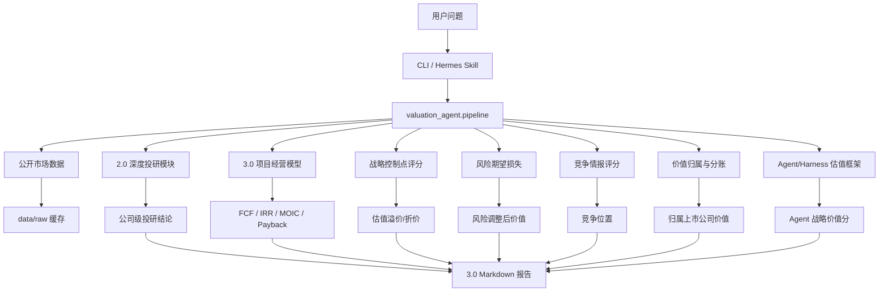

# Valuation Agent 3.0 设计方案与开发计划

## 1. 背景

Valuation Agent 2.0 已经完成从“估值计算工具”到“通用上市公司投研 Agent”的升级。用户只需要输入上市公司名称、简称或 ticker，系统即可基于公开市场数据生成深度投研报告，覆盖行情、市值、PE/PS、三情景分析、可比公司、业务分部、财务质量、风险反证和待验证问题。

但 2.0 仍然以“上市公司整体估值”为主，方法上偏公开市场静态估值和通用投研框架。结合 `excel/` 目录下的参考战略财务模型样例，3.0 需要进一步解决一个更高阶的问题：

> 如何把一家上市公司的战略项目、AI Agent 能力、合作分账、竞争控制点、风险损失和现金流结果，穿透进估值判断？

3.0 的核心不是替代 2.0，而是在 2.0 的公司级投研基础上增加“战略价值建模”和“项目级经营模型”。

## 2. 版本定位

3.0 版本定位：

> 从“通用上市公司投研估值 Agent”升级为“上市公司战略价值与项目现金流穿透 Agent”。

3.0 要支持两类问题：

1. 公司级问题：
   - 某上市公司当前估值是否合理？
   - 当前估值隐含了什么增长、利润率和估值倍数假设？
   - 相比同行，公司是否有估值溢价或折价？

2. 战略项目级问题：
   - 某个战略合作、AI Agent 项目或新业务能为上市公司贡献多少收入和利润？
   - 这个项目的现金流、IRR、MOIC、回收期如何？
   - 项目价值中多少真正归属于目标公司？
   - 哪些控制点、风险和竞争变量会影响估值？
   - 项目是否足以改变公司整体估值叙事？

## 3. 方法论升级

### 3.1 从静态倍数估值到经营模型估值

2.0 主要方法：

- 市值倒推目标股价。
- PE / PS 隐含倍数。
- 当前收入和利润对应估值。
- 三情景目标市值。

3.0 新增：

- 五年收入、成本、利润模型。
- CAPEX / OPEX / 净现金流。
- 自由现金流 FCF。
- IRR。
- MOIC。
- 投资回收期。
- 概率加权估值。

目标是让系统不只回答“市场给了多少倍”，还要回答“业务能不能自己产生足够的现金流”。

### 3.2 从普通业务分部到战略控制点

2.0 的业务分部回答“公司靠什么业务赚钱”。

3.0 需要进一步回答“公司控制了价值链中的哪个关键卡点”。

首批战略控制点模型：

| 控制点 | 核心问题 | 估值含义 |
|---|---|---|
| 网关控制 | 谁决定大模型看见企业的方式 | 决定入口、标准和上下文构建权 |
| 数据安全 | 谁解决企业 AI 采购的合规障碍 | 决定信任基础设施和采购门槛 |
| Agent 生命周期管理 | 谁持续运营、调优和管理 Agent | 决定长期订阅、复购和复利数据资产 |
| 行业 Know-how | 谁拥有场景、流程和行业方法论 | 决定复制速度和交付壁垒 |
| 渠道触达 | 谁掌握客户、门店、用户或企业入口 | 决定获客成本和规模化路径 |

输出结果需要形成 `strategic_control_score`，用于解释估值溢价或折价。

注：控制点维度与 3.5 节竞争情报评分维度统一为同一套（详见 3.5）。控制点评分是"目标公司在这套维度上的绝对强度"，竞争评分是"目标公司相对竞争者的位次"，共享底层 schema、不同聚合方式。

控制点评分到公司估值溢价不能直接 1:1 映射。一个项目即便控制点拉满，若只占公司收入 3%，公司整体 PE 不应该被拉高 50%。3.0 采用四因子映射：

```text
公司估值溢价 = control_score
             × project_strategic_weight   # 项目对公司战略叙事的重要性 0-1
             × project_revenue_share      # 项目占公司当前或预期收入比例
             × narrative_amplification    # 1.0~3.0，是否可能改变公司估值叙事
```

`narrative_amplification` 取值参考：

| 项目性质 | 取值范围 |
|---|---|
| 普通业务扩张 | 1.0 |
| 进入新业务但未形成壁垒 | 1.2-1.5 |
| 形成局部控制点，可复制 | 1.5-2.0 |
| 有概率重塑公司叙事（平台化、行业标准） | 2.0-3.0 |

报告中必须显式列出这四个因子的取值，不允许用一个"溢价系数"替代。

### 3.3 从三情景到五情景

2.0 默认三情景：

- 悲观。
- 基准。
- 乐观。

3.0 升级为五情景：

| 情景 | 说明 |
|---|---|
| 极悲观 | 战略价值被绕过、合作方介入、项目失去核心归属 |
| 悲观 | 项目推进慢、收入有限、利润率承压 |
| 基准 | 控制点逐步落地，现金流按计划释放 |
| 乐观 | 复制能力增强，收入和利润率超预期 |
| 极乐观 | 形成行业标准或平台级方法论，估值叙事显著重估 |

3.0 的情景不只调整收入增速和利润率，还要调整：

- 价值归属比例。
- 控制点强弱。
- 竞争格局。
- 资本投入。
- 复制速度。

情景轴与 3.4 风险矩阵的边界（避免双重扣减）：

- 五情景刻画**主路径不同走向**，情景之间互斥，描述战略落地速度、归属比例、控制点强弱等结构性变量的不同组合。
- 风险矩阵刻画**主路径之上的尾部冲击**（具体事件），其期望损失从**基准情景**的项目价值中扣减，不在每个情景之上重复扣一次。
- 同一个事件不允许同时进入"情景叙事"和"风险矩阵"。例如"合作方介入"已经写进极悲观情景，就不能再作为风险条目进入风险矩阵；反之亦然。

### 3.4 从定性风险到期望损失

2.0 风险规则主要用于报告解释和反证。

3.0 风险需要进入估值计算，但只用于"基准情景之外的尾部事件"，与 3.3 五情景的边界见 3.3 节末尾说明。

```text
风险调整后基准价值 = 基准情景价值 - Σ(风险概率 × 损失金额)
```

风险矩阵字段（与情景维度对齐）：

| 字段 | 说明 |
|---|---|
| risk_name | 风险名称 |
| category | 战略、组织、竞争、财务、合规、技术 |
| probability_bear | 悲观情景下的发生概率 |
| probability_base | 基准情景下的发生概率 |
| probability_bull | 乐观情景下的发生概率 |
| loss_bear | 悲观情景下的损失金额 |
| loss_base | 基准情景下的损失金额 |
| loss_bull | 乐观情景下的损失金额 |
| expected_loss_by_scenario | dict[scenario, float]，每个情景下的期望损失 |
| mitigation | 应对策略 |

数据结构上，风险矩阵的概率与损失按情景分别给出（详见 6.5），不再压缩为单一 `probability` / `loss_amount`。

首批风险类型（不与五情景叙事重复）：

- 数据安全和合规能力不足导致项目无法规模化。
- 场景文档、知识库和业务流程无法持续更新。
- Token 成本或算力成本侵蚀利润。
- 关键人员流失导致交付与运营断档。
- 客户预算砍掉或合同条款重谈。
- 关联交易披露或监管审查事件。

注：原列表中的"合作方介入"、"竞品获客"、"模型厂商绕过"、"组织能力不足"已并入五情景叙事，不再作为风险矩阵条目。

### 3.5 从普通可比公司到竞争情报评分

2.0 的可比公司分析以 PE、PS、净利率、收入增速为主。

3.0 把"战略控制点（3.2）"和"竞争情报评分"统一为同一套 10 维评估体系，避免维度重复和权重打架。同一组维度承担两种用途：

- **控制点评分**：只评目标公司自己，结果是绝对强度（0-100），用于 3.2 的估值溢价计算。
- **竞争评分**：把目标公司与主要竞争者放在一张表里同时打分，结果是相对位次和领先/落后差距，用于解释估值倍数的溢价或折价。

10 维统一评估字段：

| 维度 | 说明 | 在 3.2 控制点中的权重 |
|---|---|---|
| 网关控制能力 | 入口、上下文、路由和标准控制 | 0.15 |
| 数据安全能力 | 合规、安全审计、权限和身份管理 | 0.15 |
| Agent 生命周期管理 | 调优、版本、监控、SLA 和运营能力 | 0.15 |
| 行业 Know-how | 场景、流程、行业方法论沉淀 | 0.10 |
| 渠道触达深度 | 客户、门店、用户或企业入口的掌控力 | 0.10 |
| 技术领先度 | 模型、平台、工程能力 | 0.08 |
| 系统集成能力 | BSS/OSS、ERP、CRM 等业务系统连接能力 | 0.08 |
| 留存机制 | 用户或企业客户长期使用能力 | 0.07 |
| 资源调动能力 | 集团、渠道、生态伙伴资源 | 0.06 |
| 可复制方法论 | 从单点项目复制到多客户、多行业的能力 | 0.06 |

注：竞争评分场景下，权重由 `config/competitive_scorecards.json` 按行业模板配置，不沿用控制点权重。

输出：

- 目标公司控制点评分（10 维 + 加权总分）。
- 主要竞争者同维度评分。
- 加权总分排名。
- 相对优势和短板。
- 对估值倍数的溢价或折价建议（与 3.2 的四因子映射协同，不重复加成）。

### 3.6 从总市场空间到价值归属

3.0 必须区分：

```text
总市场空间
→ 项目收入池
→ 公司可分得收入
→ 公司毛利
→ 公司净利润
→ 公司估值贡献
```

合作项目不能只看总收入池。系统需要建模多方分账：

| 角色 | 可能贡献 | 价值归属口径 |
|---|---|---|
| 上市公司 | 技术、交付、集成、运营、行业 Know-how | 收入分成、服务费、订阅费、奖励费 |
| 大模型厂商 | 模型能力、API、推理能力 | 模型调用收入、联合产品分成 |
| 渠道方 | 用户、客户、门店、销售网络 | 渠道分成、推广费 |
| 客户方 | 场景、数据、业务流程 | 项目预算、续约、成果付费 |
| 生态伙伴 | 实施、硬件、安全、算力 | 成本项或外部分成 |

3.0 估值结果要明确说明：估值贡献是“项目总价值”还是“归属于目标上市公司的价值”。

### 3.7 从普通软件估值到 Agent/Harness 估值

针对 AI Agent 和 Harness 类项目，3.0 增加专门评估框架。原始的乘除公式 `Model × Harness × Skill × Security ÷ Token` 因各因子量纲不一致（评分？转化率？成本？），无法直接落到数字。3.0 改为加权评分 + Token 成本调节器：

```text
agent_value_score          = Σ wᵢ × scoreᵢ              # 各因子 0-100 标准化加权后 0-100
token_efficiency_modifier  = clamp(f(token_cost), 0.5, 1.5)
final_agent_score          = agent_value_score × token_efficiency_modifier
```

核心指标（每项 0-100 评分，权重 wᵢ 由配置给出）：

| 指标 | 说明 | 默认权重 |
|---|---|---|
| Model Intelligence | 模型能力、任务完成质量、推理能力 | 0.15 |
| Harness Quality | 编排、记忆、验证、安全、审计、可观测性 | 0.20 |
| Skill Surface | Skills 数量、质量、复用度、领域覆盖 | 0.15 |
| Identity/Security Control | 身份、权限、数据安全、审计和企业合规 | 0.15 |
| Workflow Ownership | 是否控制关键工作流，而不只是提供工具 | 0.20 |
| Outcome Pricing Ability | 是否能从按量计费升级到成果计费 | 0.15 |

`Token Cost Efficiency` 不进入加权和，而是作为 0.5–1.5 的调节器：Token 成本越高（侵蚀毛利），调节器越接近 0.5；越低、缓存命中率越高、路由越智能，调节器越接近 1.5。

`final_agent_score → 估值溢价` 由配置表给出（如 0–40 折价、40–60 中性、60–80 溢价、80–100 平台级溢价），不直接相乘。该框架用于解释 AI Agent 项目的估值溢价、可持续性和风险。

### 3.8 假设来源与置信度框架

3.0 引入项目级现金流模型后，最大风险不再是"算错"，而是"假设从哪儿来"。如果让 LLM 编造五年收入和成本，立刻违背 2.0 "宁可缺失不编造" 的承诺。3.0 必须显式管理假设来源。

每条 `RevenueLine` / `CostLine` / `CapexLine` / `RiskExpectedLoss` / `OwnerShare` 都必须带 `source` 与 `confidence` 字段，来源等级如下（从高到低）：

| 等级 | 来源 | 说明 |
|---|---|---|
| L1 | user_explicit | 用户在 CLI / JSON / 对话中显式给出的数字 |
| L2 | disclosed | 公开披露：年报、半年报、公告、招股书、官方新闻稿 |
| L3 | template | 项目类型模板默认值（`config/project_templates.json`） |
| L4 | analogy | 同行业类比项目（明确指出参考对象） |
| L5 | derived | 由其他假设按公式推导（必须列出公式） |
| 禁止 | fabricated | LLM 编造，3.0 不允许此来源 |

调用方约束：

- `project_valuation` 在执行计算前必须校验所有数字字段都有合法 `source`，缺失则抛出 `MissingSourceError`，由 CLI 转化为对用户的"请补充以下假设"提示。
- 报告必须包含一节 **"假设审计表"**，列出每条数字的来源等级、原始来源链接或参考、置信度和敏感度。
- 若一份报告中 L4–L5 来源比例超过 50%，报告头部必须打出"高假设依赖"警示标签。

置信度（0–1）建议参考：

| 等级 | 默认置信度 |
|---|---|
| L1 | 0.9 |
| L2 | 0.85 |
| L3 | 0.5 |
| L4 | 0.4 |
| L5 | 由组成假设的最小置信度决定 |

这套机制是兑现 §13 "项目假设可显式展示" 与 "缺失信息不编造" 承诺的唯一手段。

## 4. 产品目标

3.0 用户输入仍然保持简单：

```text
分析某上市公司
```

或：

```text
分析某上市公司 + 某战略项目
```

系统自动判断任务类型：

| 输入类型 | 系统行为 |
|---|---|
| 只输入公司名称 | 生成 2.0 深度投研报告，并补充战略控制点评估 |
| 公司 + 战略项目 | 生成公司级估值 + 项目级现金流 + 价值归属分析 |
| 公司 + AI Agent 项目 | 额外启用 Agent/Harness 估值框架 |
| 公司 + 目标市值 | 做目标市值倒推、情景分析和达成路径 |
| 公司 + 合作方 | 启用分账模型、合作结构和风险矩阵 |

## 5. 总体架构



## 6. 核心数据结构

设计原则：

- **基准 + 情景覆盖**：用户只填一份基准假设，五情景以轻量 override 表达，避免组合爆炸。
- **每个数字都有 source**：见 3.8。
- **情景维度贯穿到底**：现金流、风险期望损失、价值归属都按情景输出。

### 6.1 ProjectAssumptions

```python
SourceLevel = Literal["user_explicit", "disclosed", "template", "analogy", "derived"]
ScenarioName = Literal["very_bear", "bear", "base", "bull", "very_bull"]

class SourcedValue:
    value: float
    source: SourceLevel
    source_detail: str | None     # URL、文件路径、推导公式等
    confidence: float             # 0-1

class ProjectCaseAssumptions:
    project_name: str
    start_year: int
    years: list[int]
    revenue_lines: list[RevenueLine]
    cost_lines: list[CostLine]
    capex_lines: list[CostLine]
    tax_rate: SourcedValue
    discount_rate: SourcedValue              # 基准情景 WACC
    terminal_growth_rate: SourcedValue | None

class ScenarioOverride:
    scenario: ScenarioName
    scenario_probability: float              # 用于概率加权估值，五情景概率合计 = 1
    revenue_multiplier: dict[str, float]     # by RevenueLine.name
    margin_delta: dict[str, float]           # 毛利率绝对差
    owner_share_delta: dict[str, float]      # 价值归属比例绝对差
    discount_rate_delta: float               # 折现率相对基准的差
    capex_multiplier: dict[str, float]
    activated_risks: list[str]               # 该情景下激活的风险条目（来自 6.5）

class ProjectAssumptions:
    base_case: ProjectCaseAssumptions
    scenarios: dict[ScenarioName, ScenarioOverride]   # 必含 5 个情景
```

### 6.2 RevenueLine / CostLine

```python
class RevenueLine:
    name: str
    category: str
    base_values: dict[int, SourcedValue]    # 基准情景下的年度值，逐年带来源
    owner_share: SourcedValue                # 该收入项归属上市公司的比例
    gross_margin: SourcedValue | None

class CostLine:
    name: str
    category: str                            # opex / capex / token_cost / staff / cloud / ...
    base_values: dict[int, SourcedValue]
    is_capex: bool                           # 是否计入 CAPEX
```

注：`owner_share` 处理"行级分账"（某条收入按比例归属公司）。`value_attribution`（6.6）处理"项目级总分账"（多方分润）。两者择一使用，避免双重折减——见 7.5 模块约束。

### 6.3 CashFlowResult

```python
class ScenarioCashFlow:
    scenario: ScenarioName
    scenario_probability: float
    annual_revenue: dict[int, float]
    annual_cost: dict[int, float]
    annual_ebit: dict[int, float]
    annual_tax: dict[int, float]
    annual_fcf: dict[int, float]
    cumulative_fcf: dict[int, float]
    discount_rate: float                     # 该情景实际使用的 WACC
    npv: float
    irr: float | None
    moic: float | None
    payback_year: float | None

class CashFlowResult:
    by_scenario: dict[ScenarioName, ScenarioCashFlow]
    probability_weighted_npv: float          # Σ pᵢ × NPVᵢ
    risk_adjusted_base_npv: float            # 基准情景 NPV - 基准情景期望损失合计（见 6.5）
```

### 6.4 StrategicControlScore

```python
class ControlDimension:
    name: str                                # 与 3.5 节 10 维一致
    score: float                             # 0-100
    weight: float
    evidence: list[str]                      # 支持评分的证据/链接

class StrategicControlScore:
    dimensions: list[ControlDimension]       # 10 维统一
    weighted_score: float                    # 0-100
    project_strategic_weight: float          # 0-1，3.2 第一因子
    project_revenue_share: float             # 3.2 第二因子
    narrative_amplification: float           # 1.0-3.0，3.2 第三因子
    valuation_premium: float                 # 最终溢价系数（四因子相乘）
    explanation: list[str]
```

### 6.5 RiskExpectedLoss

```python
class RiskExpectedLoss:
    risk_name: str
    category: Literal["strategic", "organizational", "competitive",
                      "financial", "compliance", "technical"]
    probability_by_scenario: dict[ScenarioName, float]
    loss_by_scenario: dict[ScenarioName, SourcedValue]
    expected_loss_by_scenario: dict[ScenarioName, float]   # = probability × loss
    mitigation: str
```

注：与 3.3 边界一致——只列入"主路径之上的尾部冲击"，不与情景叙事重复。

### 6.6 ValueAttribution

```python
class PartnerShare:
    role: Literal["listed_company", "model_vendor", "channel_partner",
                  "client", "ecosystem_partner"]
    share_ratio: SourcedValue
    description: str | None

class ValueAttribution:
    total_project_revenue: dict[int, float]              # 按年（项目总池子）
    target_company_revenue: dict[int, float]             # 归属上市公司
    target_company_profit: dict[int, float]
    target_company_npv_contribution: float               # 归属上市公司的 NPV 贡献
    target_company_market_cap_uplift: float              # 通过 PE/PS 倍数换算的市值增量
    attribution_ratio: float                             # 加权平均
    partner_shares: list[PartnerShare]
    method: Literal["row_level_via_owner_share",
                    "project_level_via_value_attribution"]   # 必选其一
```

### 6.7 AgentHarnessScore

```python
class AgentHarnessScore:
    model_intelligence: float        # 0-100
    harness_quality: float
    skill_surface: float
    identity_security_control: float
    workflow_ownership: float
    outcome_pricing_ability: float
    weights: dict[str, float]
    agent_value_score: float                  # 0-100，加权和
    token_cost_efficiency: float              # 0-100
    token_efficiency_modifier: float          # 0.5-1.5
    final_agent_score: float                  # = agent_value_score × modifier
    valuation_premium_band: Literal["discount", "neutral", "premium", "platform_premium"]
```

## 7. 模块设计

### 7.1 project_valuation.py

职责：

- 读取项目假设。
- 计算收入、成本、EBIT、税、FCF。
- 计算 IRR、MOIC、回收期。
- 支持五情景。
- 输出项目估值贡献。

核心函数：

```python
build_project_cashflow(assumptions)
calculate_irr(cashflows)
calculate_moic(cashflows)
calculate_payback(cashflows)
calculate_project_value(cashflows, discount_rate)
```

### 7.2 strategic_control.py

职责：

- 在统一 10 维 schema 上对目标公司打绝对分。
- 调用 `map_control_score_to_premium` 做四因子映射（见 3.2）。
- 输出解释文本，列出每个因子的取值。

注：与 7.4 `competitive_scorecard.py` 共享 `ControlDimension` schema（见 6.4），后者只是改用相对位次聚合。两者必须同期开发，避免维度漂移。

核心函数：

```python
score_strategic_control(inputs)                   # 10 维评分 + 加权总分
map_control_score_to_premium(
    weighted_score,
    project_strategic_weight,
    project_revenue_share,
    narrative_amplification,
)                                                  # 四因子映射
explain_control_score(score, factors)
```

### 7.3 risk_expected_loss.py

职责：

- 读取风险矩阵（按情景的概率与损失，见 6.5）。
- 校验风险条目不与五情景叙事重复。
- 仅对**基准情景**净现值扣减期望损失（见 3.3 / 3.4 边界）。

核心函数：

```python
validate_no_overlap_with_scenarios(risks, scenarios)
calculate_expected_loss_by_scenario(risk)
calculate_total_expected_loss_for_base_case(risks)
apply_risk_adjustment_to_base_npv(base_npv, total_expected_loss)
```

### 7.4 competitive_scorecard.py

职责：

- 复用 7.2 的 10 维 schema，对目标公司和竞争者一同打分。
- 计算加权总分、相对位次、领先/落后差距。
- 把相对位次输出转化为估值倍数溢价/折价建议，避免与 7.2 的控制点溢价重复加成。

核心函数：

```python
score_competitors(scorecard_config)               # 复用 ControlDimension schema
calculate_weighted_score(company_scores, weights)
rank_competitors(results)
explain_competitive_position(results)             # 注：此模块输出建议供 reporting 参考，
                                                   # 不直接叠加到 7.2 的控制点溢价
```

### 7.5 value_attribution.py

职责：

- 建模项目收入池。
- 根据合作方分账比例计算归属于目标公司的收入、利润和价值。
- 避免把生态总价值误认为上市公司价值。

约束：

- 一份 `ProjectAssumptions` 必须**择一**使用 `RevenueLine.owner_share`（行级分账）或 `value_attribution`（项目级分账），不允许两者同时启用。模块在执行前校验，违反时抛出 `DoubleAttributionError`。
- 该模块输出 `target_company_npv_contribution` 后，再由 `reporting_v3` 调用 PE/PS 估值倍数换算 `target_company_market_cap_uplift`，两步分离，便于审计。

核心函数：

```python
validate_attribution_method(assumptions)
calculate_partner_split(revenue_pool, split_rules)
calculate_attributed_revenue(project_revenue, company_share)
calculate_attributed_profit(revenue, margin)
calculate_attributed_npv(profit, discount_rate)
calculate_market_cap_uplift(npv_contribution, multiple)
```

### 7.6 agent_harness_valuation.py

职责：

- 评估 AI Agent / Harness 类项目的专门价值因子。
- 计算 Agent 战略价值分。
- 给出 Token 成本、Skills 生态、安全控制和成果计费能力的估值解释。

核心函数：

```python
score_agent_harness(inputs)
calculate_token_efficiency(token_metrics)
map_agent_score_to_premium(score)
explain_agent_value(score)
```

### 7.7 reporting_v3.py

职责：

- 生成 3.0 Markdown 报告。
- 把 2.0 公司级报告和 3.0 项目级模型合并。
- 输出关键假设、现金流、风险调整、价值归属和结论。
- **按输入类型选择不同的报告骨架**，避免无项目输入时大量章节空跑只能写"待补充"。

报告骨架按输入类型分支：

| 输入 | 走哪条骨架 |
|---|---|
| 仅公司名 | `company_only_skeleton` |
| 公司 + 战略项目 | `company_plus_project_skeleton` |
| 公司 + 项目 + 合作方 | `company_plus_project_skeleton` + 分账章节 |
| 公司 + AI Agent 项目 | `company_plus_project_skeleton` + Agent/Harness 章节 |
| 公司 + 目标市值 | `company_only_skeleton` + 目标市值倒推章节 |

#### 7.7.1 company_only_skeleton（默认 12 节，复用 v2 的 11 节 + 控制点初评）

1. 核心结论
2. 公司与市场概览
3. 业务分部拆解
4. 财务质量与趋势
5. 增长驱动因素
6. 可比公司分析
7. 估值分析与交叉验证
8. 战略控制点初评（10 维评分 + 估值溢价/折价初判）
9. 情景与敏感性分析
10. 风险与反证
11. 待验证问题清单
12. 数据来源、缺失项、假设审计与免责声明

#### 7.7.2 company_plus_project_skeleton（13 节）

1. 核心结论（公司级 + 项目级 + 战略级三层结论）
2. 公司级估值摘要（v2 的 1–7 节压缩为单节）
3. 战略项目描述
4. 项目假设审计表（来源等级 L1–L5、置信度、缺失项）
5. 五年经营模型（基准情景）
6. FCF / IRR / MOIC / 回收期
7. 五情景分析与概率加权 NPV
8. 风险期望损失（与五情景非重叠的尾部事件）
9. 价值归属与分账（method 显式标注）
10. 战略控制点评分（10 维 + 四因子映射到公司估值溢价）
11. 竞争情报评分（同一 10 维相对位次）
12. 对公司整体估值的影响（market_cap_uplift + 单变量敏感性）
13. 待验证问题、数据来源、假设审计与免责声明

无 AI Agent 章节时不渲染 Agent/Harness 评分；有则在第 10 节后插入"Agent/Harness 估值框架"独立子节。

#### 7.7.3 强制约束

- 报告必须输出"假设审计表"，列出每个数字的 source / confidence。
- 若缺失 L1–L2 来源比例 >50%，报告头部打"高假设依赖"警示。
- 缺失字段统一聚合到末尾"缺失项"清单，不允许散落在正文里写"待补充"。

## 8. 配置文件设计

### 8.1 config/project_templates.json

用于存放常见项目类型模板：

```json
{
  "ai_agent_project": {
    "default_years": 5,
    "revenue_lines": [
      "subscription_fee",
      "implementation_fee",
      "success_fee",
      "maintenance_fee"
    ],
    "cost_lines": [
      "staff_cost",
      "model_api_cost",
      "cloud_infra_cost",
      "delivery_cost"
    ]
  }
}
```

### 8.2 config/strategic_control_weights.json

控制点评分使用与 3.5 节竞争评分一致的 10 维（共享 schema），权重为 3.0 默认值（合计 = 1.0）：

```json
{
  "gateway_control": 0.15,
  "data_security": 0.15,
  "agent_lifecycle": 0.15,
  "industry_knowhow": 0.10,
  "channel_access": 0.10,
  "technology": 0.08,
  "system_integration": 0.08,
  "retention": 0.07,
  "resource_mobilization": 0.06,
  "repeatable_methodology": 0.06
}
```

### 8.3 config/competitive_scorecards.json

竞争评分模板按行业自定义权重，但维度名称必须与 8.2 完全一致（同一 schema）：

```json
{
  "ai_agent_platform": {
    "weights": {
      "gateway_control": 0.12,
      "data_security": 0.12,
      "agent_lifecycle": 0.15,
      "industry_knowhow": 0.05,
      "channel_access": 0.12,
      "technology": 0.15,
      "system_integration": 0.10,
      "retention": 0.08,
      "resource_mobilization": 0.05,
      "repeatable_methodology": 0.06
    }
  }
}
```

### 8.4 config/risk_matrix_templates.json

```json
{
  "strategic_partnership": [
    {
      "risk_name": "partner_disintermediation",
      "category": "strategic",
      "default_probability": 0.25,
      "default_loss_ratio": 0.20
    }
  ]
}
```

### 8.5 config/partner_split_templates.json

```json
{
  "model_vendor_channel_operator_integrator": {
    "roles": [
      "listed_company",
      "model_vendor",
      "channel_partner",
      "client",
      "ecosystem_partner"
    ]
  }
}
```

## 9. CLI 与 Skill 设计

### 9.1 CLI

3.0 统一为单一入口，避免命令名风格不一致与维护多个分支。命令分支由 `--depth` 与可选 flag 决定：

```bash
python3 -m valuation_agent.cli generate-report \
  --query <company> \
  [--project <name> --template <template_id>] \
  [--project-assumptions <path/to/json>] \
  [--partners <path/to/json>] \
  [--target-market-cap <value>] \
  --depth {summary|deep|strategic|project|agent}
```

`--depth` 取值与报告骨架对应：

| --depth | 报告骨架 | 必需输入 |
|---|---|---|
| summary | v2 摘要报告 | --query |
| deep | v2 深度报告 | --query |
| strategic | 3.0 公司级骨架（含控制点初评） | --query |
| project | 3.0 公司+项目骨架 | --query, --project, --template 或 --project-assumptions |
| agent | 3.0 公司+项目骨架 + Agent/Harness 章节 | 同 project，且 template 必须是 ai_agent_project |

实际示例：

```bash
# 公司级战略报告
python3 -m valuation_agent.cli generate-report --query <company> --depth strategic

# 公司+项目报告
python3 -m valuation_agent.cli generate-report \
  --query <company> \
  --project "<某 AI Agent 战略合作项目>" \
  --template ai_agent_project \
  --depth agent

# 用户提供完整假设 JSON
python3 -m valuation_agent.cli generate-report \
  --query <company> \
  --project-assumptions ./assumptions/<project>.json \
  --depth project
```

输入校验顺序：

1. `--depth` 与可选 flag 组合是否合法。
2. 项目假设是否完整（参考 3.8 source 字段），缺失 → 直接打印"待补充字段表"，不进入计算。
3. 行级分账与项目级分账是否同时启用，启用即报错。

### 9.2 Hermes Skills

新增 Skills：

| Skill | 职责 |
|---|---|
| project-valuation-skill | 项目现金流、IRR、MOIC、回收期 |
| strategic-control-skill | 战略控制点评分和估值溢价 |
| risk-expected-loss-skill | 风险矩阵和期望损失 |
| competitive-scorecard-skill | 竞争情报打分 |
| value-attribution-skill | 多方分账和归属价值 |
| agent-harness-valuation-skill | AI Agent / Harness 专门估值框架 |
| strategic-report-skill | 3.0 综合战略估值报告 |

Skill 输入保持简单：

```json
{
  "company_name": "<company>",
  "project_name": "<project>",
  "template": "ai_agent_project",
  "depth": "agent"
}
```

注：所有 3.0 Skills 共享 `depth` 取值定义（见 9.1 表格），与 CLI 完全一致。

## 10. 报告输出样式

3.0 报告必须明确区分三层结论：

### 10.1 公司级结论

- 当前市值和估值倍数。
- 同行比较。
- 财务质量。
- 业务结构。
- 当前估值是否合理。

### 10.2 项目级结论

- 项目收入池。
- 归属目标公司的收入和利润。
- 五年现金流。
- IRR / MOIC / 回收期。
- 项目估值贡献。

### 10.3 战略级结论

- 是否形成控制点。
- 是否有估值溢价。
- 是否可能改变公司整体叙事。
- 哪些风险会推翻结论。
- 需要验证哪些关键事实。

## 11. 开发计划

排序原则：

- 把"v3 标杆用例（AI Agent + 多方合作型项目）"端到端跑通的最小集合放前面。该用例是 AI Agent 项目，因此 `agent_harness_valuation` 必须在 Phase 2 完成，而不是放到最后。
- 先做”输入校验 + 假设来源框架”，避免后续模块在错误假设上做计算。
- 控制点和竞争评分共享 schema，应同期完成；单独把竞争评分放后面会重写一次维度，浪费工作。

### Phase 1：底座、假设来源、项目现金流

目标：让一份合规的项目假设能算出五情景现金流。

任务：

1. 扩展 `schemas.py`：`SourcedValue`、`ProjectAssumptions`、`ScenarioOverride`、`CashFlowResult`。
2. 新增 `assumption_validator.py`：校验来源、归属方法互斥性、情景概率和 = 1。
3. 新增 `project_valuation.py`：FCF / IRR / MOIC / Payback / NPV，五情景遍历，概率加权。
4. 新增 `config/project_templates.json`。
5. 单元测试覆盖：source 缺失抛错、IRR 不存在、负 NPV、现金流被风险掏空、行级与项目级分账互斥。

验收：

- 给定一份带 `SourcedValue` 的项目假设，可以稳定输出五情景现金流和概率加权 NPV。
- 缺失 source 直接报错，不静默使用 0 或 LLM 编造。

### Phase 2：Agent/Harness 评估、风险期望损失

目标：把 v3 标杆用例需要的评估能力补齐。

任务：

1. 新增 `agent_harness_valuation.py`：6 维加权 + token 调节器。
2. 新增 `risk_expected_loss.py`：按情景的概率/损失矩阵，期望损失只从基准情景扣减。
3. 增加 `config/agent_harness_weights.json`、`config/risk_matrix_templates.json`。
4. 在报告中加 Agent/Harness 子节和风险扣减说明。

验收：

- 输入"AI Agent + 多方合作型"项目，可输出 Agent 战略价值分和 token 效率调节后总分。
- 风险矩阵不与五情景叙事重复条目，且不双重扣减。

### Phase 3：控制点 + 竞争评分（共享 10 维 schema）

目标：把战略判断量化，并对接公司级估值溢价。

任务：

1. 新增 `strategic_control.py`：10 维评分 + 四因子映射到溢价。
2. 新增 `competitive_scorecard.py`：复用同一 10 维 schema，相对位次输出。
3. 增加 `config/strategic_control_weights.json`、`config/competitive_scorecards.json`。
4. 在报告中合并展示控制点评分与竞争位置。

验收：

- 控制点和竞争评分共享底层 schema，未重复定义维度。
- 控制点评分通过四因子映射输出公司估值溢价区间，且记录每个因子取值。

### Phase 4：价值归属与对公司估值的影响

目标：把项目级 NPV 严谨地接到公司级市值增量。

任务：

1. 新增 `value_attribution.py`：分账模型 + market_cap_uplift 计算（两步分离）。
2. 增加 `config/partner_split_templates.json`。
3. 报告中明确”项目总价值 vs 归属上市公司价值”。

验收：

- 五种合作角色分账可正确加总到 100%（不到 100% 时显式提示）。
- 通过 PE/PS 倍数换算得出 market_cap_uplift，路径可审计。

### Phase 5：3.0 报告、CLI、Skills、文档

目标：端到端可用版本 + 完整文档。

任务：

1. 新增 `reporting_v3.py`：按 7.7 三种骨架渲染。
2. 新增 CLI 单一入口，`--depth` 路由。
3. 新增 / 更新 3.0 Hermes Skills。
4. 更新 README、ARCHITECTURE、ROADMAP、SKILLS、CHANGELOG。
5. 端到端测试：用 v3 标杆用例和 1–2 个对照公司各跑一遍。

验收：

- `--depth strategic / project / agent` 三种调用可生成对应骨架报告。
- 报告均包含”假设审计表”，无 fabricated 来源出现。
- 所有新增模块单测覆盖率 ≥ 80%。

## 12. 测试计划

### 12.1 单元测试

新增测试文件：

```text
tests/test_project_valuation.py
tests/test_strategic_control.py
tests/test_risk_expected_loss.py
tests/test_competitive_scorecard.py
tests/test_value_attribution.py
tests/test_agent_harness_valuation.py
tests/test_reporting_v3.py
```

重点场景（数学边界）：

- 现金流全为正。
- 前期投入、后期回收。
- 永远无法回收。
- IRR 不存在。
- 风险损失超过项目价值。
- 分账比例合计不等于 100%。
- 竞争评分缺字段。
- Agent/Harness 指标缺失。

业务一致性场景（必测，防止前后矛盾）：

- 同一风险事件出现在五情景叙事 + 风险矩阵 → 必须报错或合并，不允许双重扣减。
- 同一份假设同时启用 `RevenueLine.owner_share` 和 `value_attribution` → 必须报错。
- 控制点评分 = 100 + project_revenue_share = 1% + narrative_amplification = 1.0 → 公司估值溢价不应超过合理上限（如 5%）。
- 项目假设中任意字段 source = `fabricated` 或缺失 → 必须抛错，不进入计算。
- 五情景概率合计 ≠ 1 → 必须报错。
- 报告渲染时 L1+L2 来源占比 < 50% → 报告头部出现"高假设依赖"警示。
- 关键假设单变量 ±20% 敏感性表必须出现在报告"对公司整体估值的影响"章节。
- 基准情景 NPV 为负 + 概率加权 NPV 为正 → 报告不能简单输出"项目可行"，必须显式说明依赖乐观情景。

### 12.2 集成测试

测试命令（参数用占位符，实际测试在 `tests/` 目录中以 fixture 形式落地）：

```bash
python3 -m valuation_agent.cli generate-report --query <company> --depth strategic
```

```bash
python3 -m valuation_agent.cli generate-report \
  --query <company> \
  --project "<project>" \
  --template ai_agent_project \
  --depth agent
```

验收：

- 报告可以生成。
- 报告中包含公司级、项目级和战略级三层结论。
- 缺失数据有明确提示，不编造。

## 13. 版本边界

3.0 不承诺（明确不做）：

- 自动准确解析所有 Excel 财务模型。
- 自动获取所有非公开项目数据。
- 直接给出投资建议。
- 替代专业投研人员的尽调和财务建模。
- 月度或季度颗粒度现金流（仅年度）。
- 蒙特卡洛敏感性（仅五情景 + 关键变量单变量 ±20% 表）。
- 资本结构优化、税盾建模、可转债稀释（项目层面假设给定 WACC 和税率）。
- IRR hurdle rate 建议或资本预算判断（只展示 IRR，由用户判断是否过线）。
- LLM 编造（fabricated）的项目假设。任何缺失字段必须由用户/披露/模板/类比/推导提供。

3.0 承诺：

- 公开市场数据可追溯。
- 项目假设可显式展示，且每条数字带 source 与 confidence。
- 财务公式可审计。
- 风险调整可解释，且与五情景叙事不重复扣减。
- 价值归属不混淆，行级与项目级分账互斥。
- 控制点溢价经过四因子映射，不被错误放大到公司整体估值。
- 缺失信息不编造，统一聚合到"待补充字段"提示用户。

## 14. 与 2.0 的关系

3.0 复用 2.0：

- 公司识别。
- 公开市场数据。
- 缓存。
- PE / PS。
- 三情景基础估值。
- 可比公司池。
- 业务分部。
- 财务质量。
- 风险规则。
- Markdown 报告基础结构。

3.0 新增：

- 项目级经营模型。
- 五情景分析。
- IRR / MOIC / 回收期。
- 战略控制点评分。
- 风险期望损失。
- 竞争情报评分。
- 多方分账和价值归属。
- Agent/Harness 专项估值。

## 15. 第一批开发优先级

与 §11 Phase 计划保持一致，第一批开发顺序如下：

1. `schemas.py` 扩展（`SourcedValue` / `ProjectAssumptions` / `ScenarioOverride` / `CashFlowResult`）。
2. `assumption_validator.py`（来源校验、归属互斥、概率和校验）。
3. `project_valuation.py`（FCF / IRR / MOIC / Payback / NPV / 五情景 / 概率加权）。
4. `agent_harness_valuation.py`（v3 标杆用例必需）。
5. `risk_expected_loss.py`（仅扣减基准情景）。
6. `strategic_control.py` + `competitive_scorecard.py`（共享 10 维 schema，同期完成）。
7. `value_attribution.py`（先做 NPV 归属，再做 market_cap_uplift）。
8. `reporting_v3.py`（按输入类型路由三种骨架）。
9. CLI 单一入口 + 3.0 Skills。
10. README / ROADMAP / ARCHITECTURE / SKILLS / CHANGELOG 更新。

设计原则：

- 先把"假设来源"卡死，再做计算——避免在错误假设上跑通的虚假 demo。
- v3 标杆用例（AI Agent + 多方合作型项目）需要 Agent/Harness 评估，因此把它放在第 4 步而不是最后。
- 控制点和竞争评分共享 schema，同期完成，避免后期重写维度。
